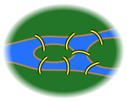

# Il problema dei 7 ponti di Eulero

Il problema dei 7 ponti di Königsberg è un semplice puzzle che fu elevato a rango di significativo contributo di importanza storica nello sviluppo della matematica. La sua soluzione da parte di Leonhard Euler nel 1736 viene considerata l'atto di nascita della teoria di grafi e prefigurò la nascente topologia contribuendo alla sua concezione e definizione di campo.

Il problema reale |  | Sua rappresentazione/idealizzazione | | Il modello
- | - | - | - | - 
 | :arrow_right: |  | :arrow_right: | 

<strong>Domanda:</strong> Esiste un giro turistico della città che ci conduca ad attraversare tutti i ponti una ed una volta sola?

Al tempo, questo semplice puzzle aveva preso piede e raccolto interesse in tutta Europa.

Eulero fornì la sua risposta nel seguente lavoro, destinato ad accrescere la sua fama forse oltre le sue aspettative:

Euler, Leonhard (1736). "Solutio problematis ad geometriam situs pertinentis". Comment. Acad. Sci. U. Petrop 8, 128–40.

## Per saperne di più rimando ai seguenti riferimenti

https://www.maa.org/press/periodicals/convergence/leonard-eulers-solution-to-the-konigsberg-bridge-problem
https://plus.maths.org/content/bridges-k-nigsberg
https://www.maa.org/sites/default/files/pdf/upload_library/22/Polya/hopkins.pdf

## Da cui ho preso alcune frasi interessanti alla ricostruzione storica 

It is not surprising that Euler felt this problem was trivial, stating in a 1736 letter to Carl Leonhard Gottlieb Ehler, mayor of Danzig, who asked him for a solution to the problem [quoted in Hopkins, 2]:
> . . .  Thus you see, most noble Sir, how this type of solution bears little relationship to mathematics, and I do not understand why you expect a mathematician to produce it, rather than anyone else, for the solution is based on reason alone, and its discovery does not depend on any mathematical principle.  Because of this, I do not know why even questions which bear so little relationship to mathematics are solved more quickly by mathematicians than by others.
 
Even though Euler found the problem trivial, he was still intrigued by it.  In a letter written the same year to Giovanni Marinoni, an Italian mathematician and engineer, Euler said [quoted in Hopkins, 2],
> This question is so banal, but seemed to me worthy of attention in that [neither] geometry, nor algebra, nor even the art of counting was sufficient to solve it.
 
Euler believed this problem was related to a topic that Gottfried Wilhelm Leibniz had once discussed and longed to work with, something Leibniz referred to as geometria situs, or geometry of position.  This so-called geometry of position is what is now called graph theory, which Euler introduces and utilizes while solving this famous problem.

### Euler's Proof
On August 26, 1735, Euler presents a paper containing the solution to the Koenigsberg bridge problem.  He addresses both this specific problem, as well as a general solution with any number of landmasses and any number of bridges.  This paper, called ‘Solutio problematis ad geometriam situs pertinentis,’ was later published in 1741 [Hopkins, 2].  Euler’s paper is divided into twenty-one numbered paragraphs, and in what follows, a simplified version of Euler’s paragraphs will be presented. ([Puoi trovare qui tale versione semplificata](https://www.maa.org/press/periodicals/convergence/leonard-eulers-solution-to-the-konigsberg-bridge-problem).)
